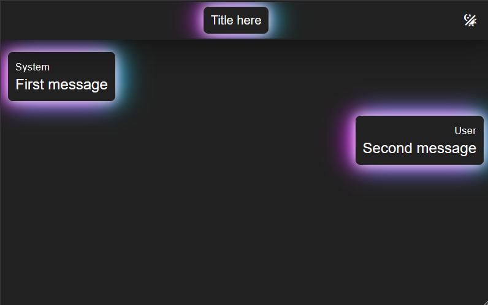
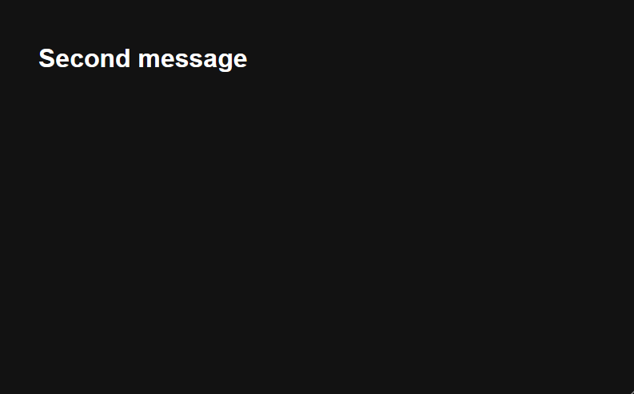

# DiDisplay - Dialogue Display

_Effortless Real-Time Dialogue Display for Eye-Catching Demos._

This Vue web application is a simple way to display conversations in real-time.
It is designed to be used in presentations, demos, and other scenarios where a sequence of messages needs to be displayed.
The application can be used to display the full conversation or only the latest message.
To use it, simply send a POST request to the API with the message you want to display.
The application can be run locally or deployed to a server, and it can be customized with logos.

Related: [blog post](https://dev.to/giubots/three-tips-for-your-next-software-demo-3p3d) and [demo at FTI fair](https://www.youtube.com/watch?v=OzSG4oxSnKM).


## Setup

The easiest way to run this project is with [Docker Compose](https://docs.docker.com/compose/).
This is an example file that starts the project configured with a custom logo.

```yaml
services:
  didisplay:
    image: ghcr.io/giubots/didisplay:master
    environment:
      - NUXT_PUBLIC_LOGOS=[{"dark":"https://www.ugent.be/++theme++ugent/static/images/logo_ugent_en.svg","light":"https://www.ugent.be/++theme++ugent/static/images/logo_ugent_en.svg"}]
      - NUXT_PUBLIC_PRE_METADATA="Pre metadata"
      - NUXT_PUBLIC_POST_METADATA="Post metadata"
    ports:
      - "3000:3000"
```

Alternatively, you can run the project locally with [Node](https://nodejs.org/en), clone the repository and run the following commands:

```shell
npm install
npm run build
npm run start
```

## Usage

Once the app is running we can test it by sending two messages.
Each conversation is associated with an id, used in the API requests and to view the conversation in the webapp.
For this example we are using `test` as the conversation id.
Note that we are also providing a title, displayed above the conversation panel.

```shell
curl --header "Content-Type: application/json" --request POST --data '{"type":"left","name":"System","text":"First message","metadata":"Title here"}' http://localhost:3000/api/test

curl --header "Content-Type: application/json" --request POST --data '{"type":"right","name":"User","text":"Second message"}' http://localhost:3000/api/test
```

In chat mode, the full conversation is displayed.
The chat mode is served at, for example, `/chat/test`.



In latest mode, only the last message is displayed: it is available at `/latest/test`.



## API

The following types are used (attributes with a question mark can be omitted).

```typescript
type Message = {
  text: string; // Body of the message
  name?: string; // A string displayed above the message
  type?: "left" | "right"; // Where the message is displayed
  metadata?: string; // The text displayed in chat mode
};
type Conversation = { messages: Message[]; metadata?: string };
type Response = { id; text; name?; type?; metadata? };
```

### /api/\<id\>

| Method | Description                                                                                                          | Body Type         | Response Type |
| ------ | -------------------------------------------------------------------------------------------------------------------- | ----------------- | ------------- |
| PUT    | Sets the message and metadata of a new or existing conversation with the provided id.                                | string or Message | Response      |
| POST   | Appends the message to a new or existing conversation with the provided id, updates the metadata if any is provided. | string or Message | Response      |
| GET    | Returns the conversation with the provided id (can be empty).                                                        | -                 | Conversation  |
| DELETE | Deletes a conversation with the provided id if it exists, returns the id.                                            | -                 | string        |

### GET /health

Returns `{ status: "UP" }` when the system is running.

### GET /info

Returns basic information about the deployment.

## Environment Variables

- NUXT_PUBLIC_LOGOS=`[{light: "url", dark: "url"}]` these logos will be displayed on the top left of the chat mode
- NUXT_PUBLIC_PRE_METADATA="Text" this text will be displayed before the metadata on the top center of the chat mode
- NUXT_PUBLIC_POST_METADATA="Text" this text will be displayed after the metadata on the top center of the chat mode
